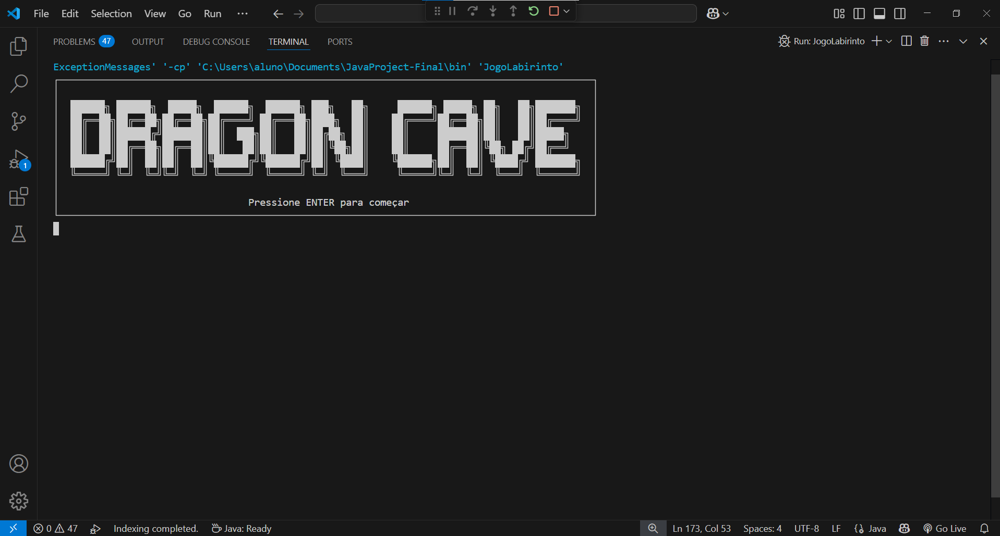

# Dragon Cave

Bem-vindo ao **Dragon Cave**, um jogo de aventura em Java onde você explora cavernas perigosas, enfrenta inimigos, coleta tesouros e busca resgatar a princesa Isabella das garras do temível dragão Azkaryel.

## Contexto e História

A princesa Isabella, herdeira do reino do amanhecer, foi raptada pelos Dragonites e levada para as profundezas de um labirinto sombrio. Cabe a você, aventureiro, adentrar esse local repleto de perigos, monstros e mistérios para salvá-la. Cada passo é um desafio, e apenas os mais corajosos sobreviverão aos horrores que espreitam nas sombras.

## Como Jogar:

# - Controles

W: Mover para cima
A: Mover para a esquerda
S: Mover para baixo
D: Mover para a direita
E: Abrir o menu do jogador (status, tesouros, consumíveis, salvar)
P: Icone da princesa
F: Avançar para o próximo andar (quando disponível)

# - Objetivo

Explore o labirinto, colete tesouros e enfrente inimigos.
Encontre a loja para comprar e vender itens.
Procure a chave para avançar de andar.
Derrote o boss final para resgatar a princesa Isabella.

# - Símbolos do Mapa

J: Você (Aventureiro)
P: Princesa (Objetivo final)
T: Tesouro (armas ou armaduras)
F: Passagem para o próximo andar
M: Loja

# - Salvando e Carregando o Jogo

Use a opção de salvar no menu do jogador para criar um save.
Para carregar, escolha a opção correspondente no início do jogo e selecione o save pelo ID.

# - Créditos

# Desenvolvedores:
- Caio Cordeiro Simões de Oliveira
- Enzo Gabriel de Souza Morais
- Theo Vieira Marcelino

# Professor Orientador:
- Lucas Rodolfo Celestino de Farias

# Funcionamento
